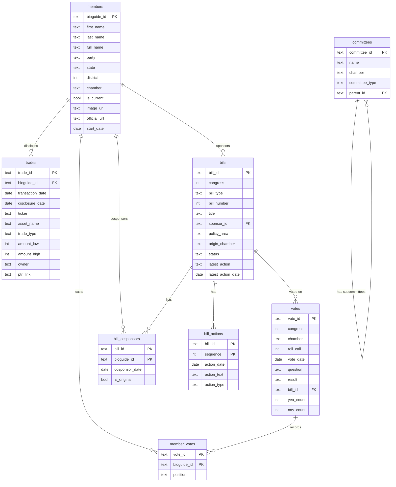

# Distillgov Database Schema

> Keep this file in sync with `schema.sql`. Update whenever tables change.

## Entity Relationship Diagram



---

## ASCII Diagram (Terminal-friendly)

```
┌─────────────────────────────────────────────────────────────────────────────────┐
│                              DISTILLGOV SCHEMA                                   │
└─────────────────────────────────────────────────────────────────────────────────┘

                                 ┌─────────────────┐
                                 │    members      │
                                 ├─────────────────┤
                                 │ PK bioguide_id  │
                                 │    first_name   │
                                 │    last_name    │
                                 │    party        │◄─────────────────────────────┐
                                 │    state        │                              │
                                 │    district     │                              │
                                 │    chamber      │                              │
                                 │    is_current   │                              │
                                 │    image_url    │                              │
                                 └────────┬────────┘                              │
                                          │                                        │
            ┌─────────────────────────────┼─────────────────────────────┐         │
            │                             │                             │         │
            ▼                             ▼                             ▼         │
┌───────────────────┐         ┌───────────────────┐         ┌───────────────────┐│
│      trades       │         │   member_votes    │         │  bill_cosponsors  ││
├───────────────────┤         ├───────────────────┤         ├───────────────────┤│
│ PK trade_id       │         │ PK vote_id    ────│────┐    │ PK bill_id    ────│─┼─┐
│ FK bioguide_id ───│─────────│ PK bioguide_id    │    │    │ PK bioguide_id ───│─┘ │
│    transaction_dt │         │    position       │    │    │    cosponsor_date │   │
│    ticker         │         └───────────────────┘    │    │    is_original    │   │
│    asset_name     │                                  │    └───────────────────┘   │
│    trade_type     │                                  │                            │
│    amount_low/high│                                  │                            │
│    owner          │                                  │                            │
│    ptr_link       │                                  │                            │
└───────────────────┘                                  │                            │
                                                       │                            │
                              ┌────────────────────────┘                            │
                              │                                                     │
                              ▼                                                     │
                    ┌───────────────────┐         ┌───────────────────┐            │
                    │      votes        │         │      bills        │◄───────────┘
                    ├───────────────────┤         ├───────────────────┤
                    │ PK vote_id        │         │ PK bill_id        │
                    │    congress       │    ┌───▶│    congress       │
                    │    chamber        │    │    │    bill_type      │
                    │    roll_call      │    │    │    bill_number    │
                    │    vote_date      │    │    │    title          │
                    │    question       │    │    │ FK sponsor_id ────│────► members
                    │    result         │    │    │    policy_area    │
                    │ FK bill_id ───────│────┘    │    status         │
                    │    yea/nay/etc    │         │    latest_action  │
                    └───────────────────┘         └─────────┬─────────┘
                                                            │
                                                            ▼
                                                  ┌───────────────────┐
                                                  │   bill_actions    │
                                                  ├───────────────────┤
                                                  │ PK bill_id ───────│───► bills
                                                  │ PK sequence       │
                                                  │    action_date    │
                                                  │    action_text    │
                                                  │    action_type    │
                                                  └───────────────────┘


┌───────────────────┐
│    committees     │  (standalone - future joins to members/bills)
├───────────────────┤
│ PK committee_id   │
│    name           │
│    chamber        │
│    committee_type │
│ FK parent_id ─────│───► committees (self-ref for subcommittees)
└───────────────────┘
```

---

## Tables

### members
The central entity. All current and historical members of Congress.

| Column | Type | Description |
|--------|------|-------------|
| `bioguide_id` | TEXT PK | Unique ID from Biographical Directory |
| `first_name` | TEXT | First name |
| `last_name` | TEXT | Last name |
| `full_name` | TEXT | Full display name |
| `party` | TEXT | 'D', 'R', 'I' |
| `state` | TEXT | Full state name |
| `district` | INTEGER | House district (NULL for senators) |
| `chamber` | TEXT | 'house' or 'senate' |
| `is_current` | BOOLEAN | Currently serving |
| `image_url` | TEXT | Official portrait URL |
| `official_url` | TEXT | Member's website |
| `phone` | TEXT | DC office phone |
| `office_address` | TEXT | DC office address |
| `leadership_role` | TEXT | Speaker, Majority Leader, etc. |
| `start_date` | DATE | Start of current term |
| `updated_at` | TIMESTAMP | Last sync |

**Relationships:**
- → `bills.sponsor_id` (one sponsor per bill)
- → `bill_cosponsors.bioguide_id` (many cosponsors per bill)
- → `member_votes.bioguide_id` (voting record)
- → `trades.bioguide_id` (financial disclosures)

---

### bills
Legislation: bills, resolutions, joint resolutions.

| Column | Type | Description |
|--------|------|-------------|
| `bill_id` | TEXT PK | Format: `{congress}-{type}-{number}` |
| `congress` | INTEGER | Congress number (e.g., 118) |
| `bill_type` | TEXT | hr, s, hjres, sjres, hconres, sconres, hres, sres |
| `bill_number` | INTEGER | Bill number |
| `title` | TEXT | Official title |
| `short_title` | TEXT | Common name |
| `introduced_date` | DATE | When introduced |
| `sponsor_id` | TEXT FK | Primary sponsor (→ members) |
| `policy_area` | TEXT | Category (Healthcare, Defense, etc.) |
| `origin_chamber` | TEXT | House or Senate |
| `latest_action` | TEXT | Most recent action text |
| `latest_action_date` | DATE | When |
| `status` | TEXT | introduced, in_committee, passed_house, passed_senate, enacted, vetoed |
| `summary` | TEXT | CRS summary |
| `full_text_url` | TEXT | Link to full text |
| `updated_at` | TIMESTAMP | Last sync |

**Relationships:**
- ← `members.bioguide_id` via `sponsor_id`
- → `bill_cosponsors` (many-to-many with members)
- → `bill_actions` (timeline)
- ← `votes.bill_id` (roll calls on this bill)

---

### votes
Roll call votes in House or Senate.

| Column | Type | Description |
|--------|------|-------------|
| `vote_id` | TEXT PK | Format: `{congress}-{chamber}-{roll_call}` |
| `congress` | INTEGER | Congress number |
| `chamber` | TEXT | house or senate |
| `session` | INTEGER | Session (1 or 2) |
| `roll_call` | INTEGER | Roll call number |
| `vote_date` | DATE | Date of vote |
| `vote_time` | TIME | Time of vote |
| `question` | TEXT | What was voted on |
| `description` | TEXT | Additional context |
| `result` | TEXT | Passed, Failed, Agreed to |
| `bill_id` | TEXT FK | Related bill (→ bills) |
| `yea_count` | INTEGER | Yes votes |
| `nay_count` | INTEGER | No votes |
| `present_count` | INTEGER | Present but not voting |
| `not_voting` | INTEGER | Absent |
| `updated_at` | TIMESTAMP | Last sync |

**Relationships:**
- ← `bills.bill_id` via `bill_id`
- → `member_votes` (individual positions)

---

### member_votes
Junction table: how each member voted on each roll call.

| Column | Type | Description |
|--------|------|-------------|
| `vote_id` | TEXT PK | → votes |
| `bioguide_id` | TEXT PK | → members |
| `position` | TEXT | 'Yes', 'No', 'Present', 'Not Voting' |

**Relationships:**
- ← `votes.vote_id`
- ← `members.bioguide_id`

---

### trades
Stock trading disclosures (STOCK Act filings).

| Column | Type | Description |
|--------|------|-------------|
| `trade_id` | TEXT PK | Hash of bioguide + filing |
| `bioguide_id` | TEXT FK | → members |
| `transaction_date` | DATE | When trade occurred |
| `disclosure_date` | DATE | When disclosed |
| `ticker` | TEXT | Stock symbol |
| `asset_name` | TEXT | Company/asset name |
| `asset_type` | TEXT | Stock, Bond, Option, etc. |
| `trade_type` | TEXT | Purchase, Sale, Exchange |
| `amount_low` | INTEGER | Lower bound of range |
| `amount_high` | INTEGER | Upper bound of range |
| `owner` | TEXT | Self, Spouse, Child, Joint |
| `ptr_link` | TEXT | Link to original PDF |
| `comment` | TEXT | Notes |
| `updated_at` | TIMESTAMP | Last sync |

**Relationships:**
- ← `members.bioguide_id`

---

### bill_cosponsors
Junction table: members who cosponsor bills.

| Column | Type | Description |
|--------|------|-------------|
| `bill_id` | TEXT PK | → bills |
| `bioguide_id` | TEXT PK | → members |
| `cosponsor_date` | DATE | When they signed on |
| `is_original` | BOOLEAN | Original cosponsor at introduction |

**Relationships:**
- ← `bills.bill_id`
- ← `members.bioguide_id`

---

### bill_actions
Timeline of actions on a bill.

| Column | Type | Description |
|--------|------|-------------|
| `bill_id` | TEXT PK | → bills |
| `sequence` | INTEGER PK | Order of action |
| `action_date` | DATE | When |
| `action_text` | TEXT | What happened |
| `action_type` | TEXT | Category |
| `chamber` | TEXT | Where it happened |

**Relationships:**
- ← `bills.bill_id`

---

### committees
Congressional committees.

| Column | Type | Description |
|--------|------|-------------|
| `committee_id` | TEXT PK | System code |
| `name` | TEXT | Committee name |
| `chamber` | TEXT | house, senate, joint |
| `committee_type` | TEXT | standing, select, joint, subcommittee |
| `parent_id` | TEXT FK | Parent committee (for subcommittees) |
| `url` | TEXT | Committee website |

**Relationships:**
- Self-referential via `parent_id` for subcommittees

---

## Aggregation Tables (Planned)

These will be materialized views or tables computed from base data:

### member_stats
Pre-computed stats for each member.

```sql
-- Planned columns:
bioguide_id         -- PK, FK → members
bills_sponsored     -- COUNT of bills where sponsor_id = this member
bills_enacted       -- COUNT of sponsored bills with status = 'enacted'
party_loyalty_pct   -- % of votes matching party majority
bipartisan_score    -- Cosponsoring across party lines
missed_votes_pct    -- % of votes where position = 'Not Voting'
trades_count        -- COUNT of disclosures
total_trade_value   -- SUM of (amount_low + amount_high) / 2
```

### bill_stats
Pre-computed stats for each bill.

```sql
-- Planned columns:
bill_id             -- PK, FK → bills
cosponsor_count     -- Total cosponsors
dem_cosponsors      -- Democratic cosponsors
rep_cosponsors      -- Republican cosponsors
bipartisan_ratio    -- Cross-party support score
days_pending        -- Days since introduced
```

### congress_overview
System-wide stats for dashboard.

```sql
-- Planned columns:
congress            -- PK (e.g., 118)
total_bills
bills_in_committee
bills_passed_house
bills_passed_senate
bills_enacted
enactment_rate      -- % that become law
top_policy_areas    -- JSON array
```

---

## Indexes

```sql
-- Members
idx_members_state, idx_members_chamber, idx_members_party, idx_members_current

-- Bills
idx_bills_congress, idx_bills_sponsor, idx_bills_status, idx_bills_policy_area

-- Votes
idx_votes_date, idx_votes_chamber, idx_votes_bill

-- Member Votes
idx_member_votes_member

-- Trades
idx_trades_member, idx_trades_ticker, idx_trades_date
```

---

## Data Sources

| Table | Source | Sync Method |
|-------|--------|-------------|
| members | Congress.gov API | `sync_members.py` |
| bills | Congress.gov API | `sync_bills.py` |
| votes | Congress.gov API | `sync_votes.py` |
| member_votes | Congress.gov API | `sync_votes.py` |
| trades | House/Senate disclosures via CapitolGains | `sync_trades.py` |
| bill_cosponsors | Congress.gov API | `sync_bills.py` (planned) |
| bill_actions | Congress.gov API | `sync_bills.py` (planned) |
| committees | Congress.gov API | (not implemented) |
