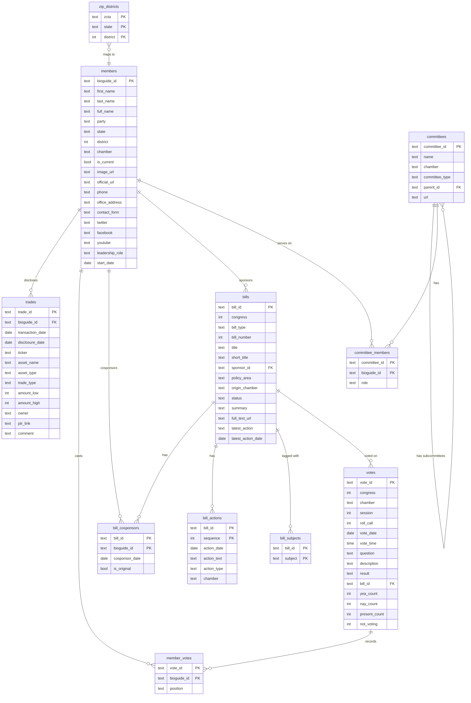

# Distillgov Database Schema

> Keep this file in sync with `schema.sql`. Update whenever tables change.

## Entity Relationship Diagram



---

## ASCII Diagram (Terminal-friendly)

```
┌─────────────────────────────────────────────────────────────────────────────────┐
│                              DISTILLGOV SCHEMA                                 │
└─────────────────────────────────────────────────────────────────────────────────┘

                                 ┌─────────────────┐
                                 │    members       │
                                 ├─────────────────┤
                                 │ PK bioguide_id   │
                                 │    first_name    │
                                 │    last_name     │
                                 │    party         │◄─────────────────────────────┐
                                 │    state         │                              │
                                 │    district      │                              │
                                 │    chamber       │                              │
                                 │    is_current    │                              │
                                 │    image_url     │                              │
                                 │    contact_form  │                              │
                                 │    twitter       │                              │
                                 │    facebook      │                              │
                                 │    youtube       │                              │
                                 └────────┬────────┘                              │
                                          │                                       │
         ┌──────────────┬─────────────────┼──────────────────┬──────────┐         │
         │              │                 │                  │          │         │
         ▼              ▼                 ▼                  ▼          ▼         │
┌─────────────┐ ┌─────────────┐ ┌─────────────────┐ ┌────────────┐ ┌──────────┐│
│   trades    │ │member_votes │ │ bill_cosponsors  │ │ committee  │ │   zip    ││
├─────────────┤ ├─────────────┤ ├─────────────────┤ │ _members   │ │_districts││
│PK trade_id  │ │PK vote_id ──│─┐│PK bill_id ─────│┐├────────────┤ ├──────────┤│
│FK bioguide  │ │PK bioguide  │ ││PK bioguide ────│┘│PK committee│ │PK zcta   ││
│   ticker    │ │   position  │ ││   cosponsor_dt  │ │PK bioguide │ │PK state  ││
│   amount_*  │ └─────────────┘ │└─────────────────┘ │   role     │ │PK dist   ││
│   owner     │                 │                    └─────┬──────┘ └──────────┘│
│   ptr_link  │                 │                          │                    │
└─────────────┘                 │                          ▼                    │
                                │                 ┌─────────────────┐           │
                                │                 │   committees    │           │
                                │                 ├─────────────────┤           │
                                │                 │PK committee_id  │           │
                                │                 │   name          │           │
                                │                 │   chamber       │           │
                                │                 │   committee_type│           │
                                │                 │FK parent_id ────│──► self   │
                                │                 │   url           │           │
                                │                 └─────────────────┘           │
                                │                                               │
                  ┌─────────────┘                                               │
                  │                                                             │
                  ▼                                                             │
        ┌───────────────────┐         ┌───────────────────┐                    │
        │      votes        │         │      bills        │◄───────────────────┘
        ├───────────────────┤         ├───────────────────┤
        │ PK vote_id        │         │ PK bill_id        │
        │    congress       │    ┌───▶│    congress       │
        │    chamber        │    │    │    bill_type      │
        │    roll_call      │    │    │    title          │
        │    vote_date      │    │    │    short_title    │
        │    question       │    │    │ FK sponsor_id ────│────► members
        │    result         │    │    │    policy_area    │
        │ FK bill_id ───────│────┘    │    status         │
        │    yea/nay/etc    │         │    summary        │
        └───────────────────┘         │    full_text_url  │
                                      └─────────┬────┬────┘
                                                │    │
                                                ▼    ▼
                                   ┌──────────────┐ ┌──────────────┐
                                   │ bill_actions  │ │bill_subjects │
                                   ├──────────────┤ ├──────────────┤
                                   │PK bill_id    │ │PK bill_id    │
                                   │PK sequence   │ │PK subject    │
                                   │  action_date │ └──────────────┘
                                   │  action_text │
                                   │  action_type │
                                   └──────────────┘
```

---

## Tables

### members
The central entity. All current and historical members of Congress.

| Column | Type | Description |
|--------|------|-------------|
| `bioguide_id` | TEXT PK | Unique ID from Biographical Directory |
| `first_name` | TEXT | First name |
| `last_name` | TEXT | Last name |
| `full_name` | TEXT | Full display name |
| `party` | TEXT | 'D', 'R', 'I' |
| `state` | TEXT | 2-letter state abbreviation |
| `district` | INTEGER | House district (NULL for senators) |
| `chamber` | TEXT | 'house' or 'senate' |
| `is_current` | BOOLEAN | Currently serving |
| `image_url` | TEXT | Official portrait URL |
| `official_url` | TEXT | Member's website |
| `phone` | TEXT | DC office phone |
| `office_address` | TEXT | DC office address |
| `contact_form` | TEXT | URL for online contact form |
| `leadership_role` | TEXT | Speaker, Majority Leader, etc. |
| `start_date` | DATE | Start of current term |
| `twitter` | TEXT | Twitter/X handle |
| `facebook` | TEXT | Facebook account ID |
| `youtube` | TEXT | YouTube channel |
| `updated_at` | TIMESTAMP | Last sync |

**Relationships:**
- → `bills.sponsor_id` (one sponsor per bill)
- → `bill_cosponsors.bioguide_id` (many cosponsors per bill)
- → `member_votes.bioguide_id` (voting record)
- → `trades.bioguide_id` (financial disclosures)
- → `committee_members.bioguide_id` (committee assignments)

---

### bills
Legislation: bills, resolutions, joint resolutions.

| Column | Type | Description |
|--------|------|-------------|
| `bill_id` | TEXT PK | Format: `{congress}-{type}-{number}` |
| `congress` | INTEGER | Congress number (e.g., 118) |
| `bill_type` | TEXT | hr, s, hjres, sjres, hconres, sconres, hres, sres |
| `bill_number` | INTEGER | Bill number |
| `title` | TEXT | Official title |
| `short_title` | TEXT | Common name |
| `introduced_date` | DATE | When introduced |
| `sponsor_id` | TEXT FK | Primary sponsor (→ members) |
| `policy_area` | TEXT | Category (Healthcare, Defense, etc.) |
| `origin_chamber` | TEXT | House or Senate |
| `latest_action` | TEXT | Most recent action text |
| `latest_action_date` | DATE | When |
| `status` | TEXT | introduced, in_committee, passed_house, passed_senate, enacted, vetoed |
| `summary` | TEXT | CRS summary |
| `full_text_url` | TEXT | Link to full text |
| `updated_at` | TIMESTAMP | Last sync |

**Relationships:**
- ← `members.bioguide_id` via `sponsor_id`
- → `bill_cosponsors` (many-to-many with members)
- → `bill_actions` (timeline)
- → `bill_subjects` (legislative subject tags)
- ← `votes.bill_id` (roll calls on this bill)

---

### votes
Roll call votes in House or Senate.

| Column | Type | Description |
|--------|------|-------------|
| `vote_id` | TEXT PK | Format: `{congress}-{chamber}-{session}-{roll_call}` |
| `congress` | INTEGER | Congress number |
| `chamber` | TEXT | house or senate |
| `session` | INTEGER | Session (1 or 2) |
| `roll_call` | INTEGER | Roll call number |
| `vote_date` | DATE | Date of vote |
| `vote_time` | TIME | Time of vote |
| `question` | TEXT | What was voted on |
| `description` | TEXT | Additional context |
| `result` | TEXT | Passed, Failed, Agreed to |
| `bill_id` | TEXT FK | Related bill (→ bills) |
| `yea_count` | INTEGER | Yes votes |
| `nay_count` | INTEGER | No votes |
| `present_count` | INTEGER | Present but not voting |
| `not_voting` | INTEGER | Absent |
| `updated_at` | TIMESTAMP | Last sync |

**Relationships:**
- ← `bills.bill_id` via `bill_id`
- → `member_votes` (individual positions)

---

### member_votes
Junction table: how each member voted on each roll call.

| Column | Type | Description |
|--------|------|-------------|
| `vote_id` | TEXT PK | → votes |
| `bioguide_id` | TEXT PK | → members |
| `position` | TEXT | 'Yes', 'Yea', 'No', 'Nay', 'Present', 'Not Voting' |

**Relationships:**
- ← `votes.vote_id`
- ← `members.bioguide_id`

---

### trades
Stock trading disclosures (STOCK Act filings).

| Column | Type | Description |
|--------|------|-------------|
| `trade_id` | TEXT PK | Hash of bioguide + filing |
| `bioguide_id` | TEXT FK | → members |
| `transaction_date` | DATE | When trade occurred |
| `disclosure_date` | DATE | When disclosed |
| `ticker` | TEXT | Stock symbol |
| `asset_name` | TEXT | Company/asset name |
| `asset_type` | TEXT | Stock, Bond, Option, etc. |
| `trade_type` | TEXT | Purchase, Sale, Exchange |
| `amount_low` | INTEGER | Lower bound of range |
| `amount_high` | INTEGER | Upper bound of range |
| `owner` | TEXT | Self, Spouse, Child, Joint |
| `ptr_link` | TEXT | Link to original PDF |
| `comment` | TEXT | Notes |
| `updated_at` | TIMESTAMP | Last sync |

**Relationships:**
- ← `members.bioguide_id`

---

### bill_cosponsors
Junction table: members who cosponsor bills.

| Column | Type | Description |
|--------|------|-------------|
| `bill_id` | TEXT PK | → bills |
| `bioguide_id` | TEXT PK | → members |
| `cosponsor_date` | DATE | When they signed on |
| `is_original` | BOOLEAN | Original cosponsor at introduction |

**Relationships:**
- ← `bills.bill_id`
- ← `members.bioguide_id`

---

### bill_actions
Timeline of actions on a bill.

| Column | Type | Description |
|--------|------|-------------|
| `bill_id` | TEXT PK | → bills |
| `sequence` | INTEGER PK | Order of action |
| `action_date` | DATE | When |
| `action_text` | TEXT | What happened |
| `action_type` | TEXT | Category |
| `chamber` | TEXT | Where it happened |

**Relationships:**
- ← `bills.bill_id`

---

### bill_subjects
Legislative subject tags for bills (many-to-many).

| Column | Type | Description |
|--------|------|-------------|
| `bill_id` | TEXT PK | → bills |
| `subject` | TEXT PK | Legislative subject tag (e.g., "Healthcare", "Taxation") |

**Relationships:**
- ← `bills.bill_id`

---

### committees
Congressional committees and subcommittees.

| Column | Type | Description |
|--------|------|-------------|
| `committee_id` | TEXT PK | System code |
| `name` | TEXT | Committee name |
| `chamber` | TEXT | house, senate, joint |
| `committee_type` | TEXT | standing, select, joint, subcommittee |
| `parent_id` | TEXT FK | Parent committee (for subcommittees) |
| `url` | TEXT | Committee website |

**Relationships:**
- Self-referential via `parent_id` for subcommittees
- → `committee_members` (membership roster)

---

### committee_members
Junction table: members serving on committees.

| Column | Type | Description |
|--------|------|-------------|
| `committee_id` | TEXT PK | → committees |
| `bioguide_id` | TEXT PK | → members |
| `role` | TEXT | 'Chair', 'Ranking Member', 'Vice Chair', 'Member' |

**Relationships:**
- ← `committees.committee_id`
- ← `members.bioguide_id`

---

### zip_districts
Zip code to congressional district mapping.

| Column | Type | Description |
|--------|------|-------------|
| `zcta` | TEXT PK | 5-digit ZIP Code Tabulation Area |
| `state` | TEXT PK | 2-letter state abbreviation |
| `district` | INTEGER PK | Congressional district number (0 = at-large) |

**Notes:**
- A single zip code can span multiple districts (composite PK)
- Used by `/api/members/by-zip/{zip}` and `/api/activity/recent?zip_code=`

---

## Political Calendar

Legislative activity follows these cycles:

| Cycle | Duration | Significance |
|-------|----------|--------------|
| **Congress** | 2 years | Natural unit. Bills die at end. (e.g., 118th: 2023-2025) |
| **Session** | 1 year | Two per Congress. Budget deadlines. |
| **Quarter** | 3 months | Useful for trends and reporting |
| **Fiscal Year** | Oct 1 - Sep 30 | Budget and appropriations rhythm |
| **Election Proximity** | Variable | Activity spikes pre-election, dies in lame duck |

---

## Analytics Architecture (dbt)

Raw tables are transformed through a three-layer dbt pipeline:

```
┌─────────────────────────────────────────────────────────────────┐
│                       dbt MODEL LAYERS                          │
└─────────────────────────────────────────────────────────────────┘

  Raw Tables              Staging (stg_*)           Intermediate (int_*)
  (schema.sql)            (clean + type)            (shared logic)

  members ──────────────▶ stg_members ─────┐
  bills ────────────────▶ stg_bills ───────┤
  votes ────────────────▶ stg_votes ───────┼──▶ int_party_vote_majority
  member_votes ─────────▶ stg_member_votes─┤
  bill_cosponsors ──────▶ stg_bill_cosponsors
  bill_actions ─────────▶ stg_bill_actions─┤
  bill_subjects ────────▶ stg_bill_subjects┤
  trades ───────────────▶ stg_trades ──────┤
  committees ───────────▶ stg_committees ──┤
  committee_members ────▶ stg_committee_members
  zip_districts ────────▶ stg_zip_districts┘

                                      │
                                      ▼
                          Marts (fct_* + agg_*)

                          ┌──────────────────┐
                          │    fct_bills     │  Enriched bills: sponsor info,
                          │    fct_members   │  time dims, cosponsor stats,
                          └──────┬───────────┘  voting metrics, activity score
                                 │
                          ┌──────┴───────────┐
                          │  agg_* rollups   │  Congress summary, policy
                          │  (9 models)      │  breakdown, member scorecard,
                          └──────────────────┘  chamber/party comparisons
```

### Fact Models

**`fct_bills`** — Enriched bills with denormalized sponsor info, cosponsor counts (total, D, R), time dimensions (fiscal year), and status flags (is_bipartisan, is_enacted, is_stale).

**`fct_members`** — Enriched members with sponsorship stats (bills_sponsored, success_rate), voting stats (attendance_rate, party_loyalty_pct), and a composite activity_score (0-100).

See `dbt_distillgov/models/marts/_marts.yml` for full column documentation.

| Column | Type | Description |
|--------|------|-------------|
| `bioguide_id` | TEXT PK | → members |
| `full_name` | TEXT | Display name |
| `party` | TEXT | D, R, I |
| `state` | TEXT | State |
| `chamber` | TEXT | house or senate |
| | | |
| *Sponsorship Stats* | | |
| `bills_sponsored` | INTEGER | Total bills sponsored |
| `bills_enacted` | INTEGER | Sponsored bills that became law |
| `sponsor_success_rate` | DECIMAL | % of sponsored bills enacted |
| | | |
| *Voting Stats* | | (requires vote data) |
| `total_roll_calls` | INTEGER | Total roll call entries (including Not Voting) |
| `votes_missed` | INTEGER | Votes missed |
| `attendance_rate` | DECIMAL | % attendance |
| `party_loyalty_rate` | DECIMAL | % votes with party majority |
| | | |
| *Trading Stats* | | (requires trade data) |
| `disclosure_count` | INTEGER | PTR filings |
| `total_trades` | INTEGER | Individual transactions |
| `estimated_value` | INTEGER | Midpoint of ranges |

### vote_facts
Enriched votes with computed dimensions. *(When vote data available)*

| Column | Type | Description |
|--------|------|-------------|
| `vote_id` | TEXT PK | → votes |
| `vote_date` | DATE | Date of vote |
| `vote_week` | DATE | Week |
| `vote_month` | DATE | Month |
| `congress` | INTEGER | Congress number |
| `chamber` | TEXT | house or senate |
| `result` | TEXT | Passed, Failed |
| `bill_id` | TEXT FK | Related bill |
| `margin` | INTEGER | Yea - Nay |
| `is_close` | BOOLEAN | Margin < 10 |
| `is_bipartisan` | BOOLEAN | Significant cross-party support |
| `is_party_line` | BOOLEAN | >90% party alignment |

### trade_facts
Enriched trades with computed dimensions. *(When trade data available)*

| Column | Type | Description |
|--------|------|-------------|
| `trade_id` | TEXT PK | → trades |
| `bioguide_id` | TEXT FK | → members |
| `transaction_date` | DATE | Trade date |
| `transaction_week` | DATE | Week |
| `transaction_month` | DATE | Month |
| `transaction_quarter` | DATE | Quarter |
| `ticker` | TEXT | Stock symbol |
| `trade_type` | TEXT | Purchase, Sale |
| `amount_midpoint` | INTEGER | (low + high) / 2 |
| `member_party` | TEXT | Trader's party |
| `member_chamber` | TEXT | Trader's chamber |

---

## Views

Views provide rollups at query time. No data duplication.

### v_congress_summary
High-level stats per Congress.

```sql
SELECT congress, total_bills, enacted, in_committee, enactment_rate
```

### v_monthly_activity
Bill activity by month.

```sql
SELECT month, bills_introduced, bills_enacted, bills_passed_house, bills_passed_senate
```

| Model | Description |
|-------|-------------|
| `agg_congress_summary` | Congress-level bill aggregations |
| `agg_monthly_activity` | Monthly bill introduction and enactment counts |
| `agg_quarterly_activity` | Quarterly activity with enactment rates |
| `agg_policy_breakdown` | Bills grouped by policy area |
| `agg_chamber_comparison` | House vs Senate bill statistics |
| `agg_party_breakdown` | Democratic vs Republican sponsorship stats |
| `agg_member_scorecard` | Current member rankings by legislative activity |
| `agg_bill_type_breakdown` | Bill counts by type (HR, S, HJRES, etc.) |
| `agg_fiscal_year_summary` | Fiscal year trends for bill activity |

---

## Indexes

```sql
-- Members
idx_members_state, idx_members_chamber, idx_members_party, idx_members_current

-- Bills
idx_bills_congress, idx_bills_sponsor, idx_bills_status, idx_bills_policy_area
idx_bills_latest_action_date, idx_bills_introduced_date

-- Votes
idx_votes_date, idx_votes_chamber, idx_votes_bill

-- Member Votes
idx_member_votes_member, idx_member_votes_vote

-- Bill Cosponsors
idx_cosponsors_member

-- Bill Actions
idx_actions_bill

-- Bill Subjects
idx_bill_subjects_subject, idx_bill_subjects_bill

-- Trades
idx_trades_member, idx_trades_ticker, idx_trades_date, idx_trades_disclosure_date

-- Zip Districts
idx_zip_districts_zcta

-- Committee Members
idx_committee_members_member
```

---

## Data Sources

| Table | Source | Sync Command | Notes |
|-------|--------|--------------|-------|
| members | Congress.gov API | `sync members` | Fast (~1 min) |
| members (enriched) | YAML (congress-legislators) | `sync enrich-members` | Phone, address, social media |
| bills | Congress.gov API | `sync bills` | Fast (~2 min) |
| bill_cosponsors | Congress.gov API | `sync cosponsors` | Slow (~30 min, 1 call/bill) |
| bill_actions | Congress.gov API | `sync actions` | Slow (~30 min, 1 call/bill) |
| bill_subjects | Congress.gov API | `sync subjects` | Slow (~30 min, 1 call/bill) |
| votes (House) | Congress.gov API | `sync votes` | Medium (~5 min) |
| member_votes (House) | Congress.gov API | `sync member-votes` | Medium (~10 min, 1 call/vote) |
| votes (Senate) | senate.gov XML | `sync senate-votes` | Fast (~1 min) |
| member_votes (Senate) | senate.gov XML | `sync senate-member-votes` | Fast (~1 min) |
| committees + committee_members | Congress.gov API | `sync committees` | Fast (~2 min) |
| zip_districts | Static CSV | `sync load-zips` | One-time load (~42K rows) |
| trades | House/Senate disclosures | `sync trades` | Via CapitolGains |

---

## Data Pipeline

### Sync Order

Dependencies require this order:

```
1. members              (no dependencies)
2. enrich-members       (requires: members)
3. bills                (no dependencies)
4. cosponsors           (requires: bills, members)
5. actions              (requires: bills)
6. subjects             (requires: bills)
7. summaries            (requires: bills)
8. votes                (no dependencies)
9. member-votes         (requires: votes, members)
10. senate-votes        (no dependencies)
11. senate-member-votes (requires: senate-votes, members)
12. committees          (requires: members)
13. load-zips           (no dependencies)
14. dbt run             (requires: all above)
```

`sync all` runs steps 1-13 in the correct order.

### API Limits

- Congress.gov: 5,000 requests/hour
- senate.gov: No explicit limit (public XML)
