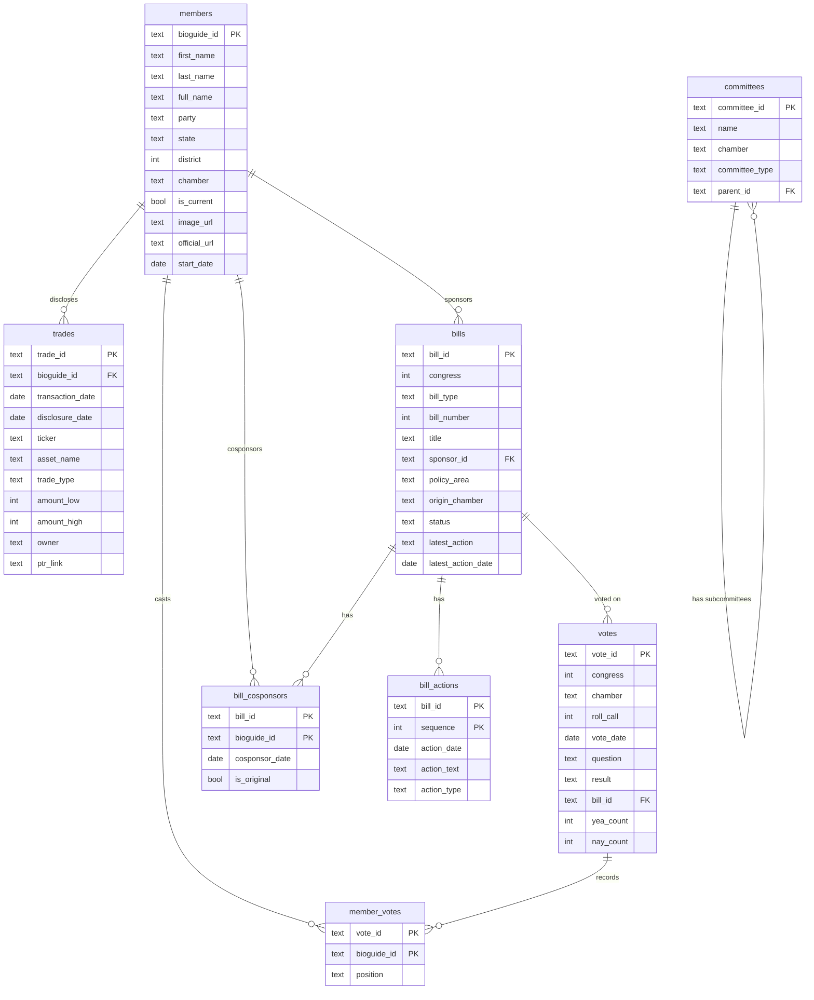

# Distillgov Database Schema

> Keep this file in sync with `schema.sql`. Update whenever tables change.

## Entity Relationship Diagram



---

## ASCII Diagram (Terminal-friendly)

```
┌─────────────────────────────────────────────────────────────────────────────────┐
│                              DISTILLGOV SCHEMA                                   │
└─────────────────────────────────────────────────────────────────────────────────┘

                                 ┌─────────────────┐
                                 │    members      │
                                 ├─────────────────┤
                                 │ PK bioguide_id  │
                                 │    first_name   │
                                 │    last_name    │
                                 │    party        │◄─────────────────────────────┐
                                 │    state        │                              │
                                 │    district     │                              │
                                 │    chamber      │                              │
                                 │    is_current   │                              │
                                 │    image_url    │                              │
                                 └────────┬────────┘                              │
                                          │                                        │
            ┌─────────────────────────────┼─────────────────────────────┐         │
            │                             │                             │         │
            ▼                             ▼                             ▼         │
┌───────────────────┐         ┌───────────────────┐         ┌───────────────────┐│
│      trades       │         │   member_votes    │         │  bill_cosponsors  ││
├───────────────────┤         ├───────────────────┤         ├───────────────────┤│
│ PK trade_id       │         │ PK vote_id    ────│────┐    │ PK bill_id    ────│─┼─┐
│ FK bioguide_id ───│─────────│ PK bioguide_id    │    │    │ PK bioguide_id ───│─┘ │
│    transaction_dt │         │    position       │    │    │    cosponsor_date │   │
│    ticker         │         └───────────────────┘    │    │    is_original    │   │
│    asset_name     │                                  │    └───────────────────┘   │
│    trade_type     │                                  │                            │
│    amount_low/high│                                  │                            │
│    owner          │                                  │                            │
│    ptr_link       │                                  │                            │
└───────────────────┘                                  │                            │
                                                       │                            │
                              ┌────────────────────────┘                            │
                              │                                                     │
                              ▼                                                     │
                    ┌───────────────────┐         ┌───────────────────┐            │
                    │      votes        │         │      bills        │◄───────────┘
                    ├───────────────────┤         ├───────────────────┤
                    │ PK vote_id        │         │ PK bill_id        │
                    │    congress       │    ┌───▶│    congress       │
                    │    chamber        │    │    │    bill_type      │
                    │    roll_call      │    │    │    bill_number    │
                    │    vote_date      │    │    │    title          │
                    │    question       │    │    │ FK sponsor_id ────│────► members
                    │    result         │    │    │    policy_area    │
                    │ FK bill_id ───────│────┘    │    status         │
                    │    yea/nay/etc    │         │    latest_action  │
                    └───────────────────┘         └─────────┬─────────┘
                                                            │
                                                            ▼
                                                  ┌───────────────────┐
                                                  │   bill_actions    │
                                                  ├───────────────────┤
                                                  │ PK bill_id ───────│───► bills
                                                  │ PK sequence       │
                                                  │    action_date    │
                                                  │    action_text    │
                                                  │    action_type    │
                                                  └───────────────────┘


┌───────────────────┐
│    committees     │  (standalone - future joins to members/bills)
├───────────────────┤
│ PK committee_id   │
│    name           │
│    chamber        │
│    committee_type │
│ FK parent_id ─────│───► committees (self-ref for subcommittees)
└───────────────────┘
```

---

## Tables

### members
The central entity. All current and historical members of Congress.

| Column | Type | Description |
|--------|------|-------------|
| `bioguide_id` | TEXT PK | Unique ID from Biographical Directory |
| `first_name` | TEXT | First name |
| `last_name` | TEXT | Last name |
| `full_name` | TEXT | Full display name |
| `party` | TEXT | 'D', 'R', 'I' |
| `state` | TEXT | Full state name |
| `district` | INTEGER | House district (NULL for senators) |
| `chamber` | TEXT | 'house' or 'senate' |
| `is_current` | BOOLEAN | Currently serving |
| `image_url` | TEXT | Official portrait URL |
| `official_url` | TEXT | Member's website |
| `phone` | TEXT | DC office phone |
| `office_address` | TEXT | DC office address |
| `leadership_role` | TEXT | Speaker, Majority Leader, etc. |
| `start_date` | DATE | Start of current term |
| `updated_at` | TIMESTAMP | Last sync |

**Relationships:**
- → `bills.sponsor_id` (one sponsor per bill)
- → `bill_cosponsors.bioguide_id` (many cosponsors per bill)
- → `member_votes.bioguide_id` (voting record)
- → `trades.bioguide_id` (financial disclosures)

---

### bills
Legislation: bills, resolutions, joint resolutions.

| Column | Type | Description |
|--------|------|-------------|
| `bill_id` | TEXT PK | Format: `{congress}-{type}-{number}` |
| `congress` | INTEGER | Congress number (e.g., 118) |
| `bill_type` | TEXT | hr, s, hjres, sjres, hconres, sconres, hres, sres |
| `bill_number` | INTEGER | Bill number |
| `title` | TEXT | Official title |
| `short_title` | TEXT | Common name |
| `introduced_date` | DATE | When introduced |
| `sponsor_id` | TEXT FK | Primary sponsor (→ members) |
| `policy_area` | TEXT | Category (Healthcare, Defense, etc.) |
| `origin_chamber` | TEXT | House or Senate |
| `latest_action` | TEXT | Most recent action text |
| `latest_action_date` | DATE | When |
| `status` | TEXT | introduced, in_committee, passed_house, passed_senate, enacted, vetoed |
| `summary` | TEXT | CRS summary |
| `full_text_url` | TEXT | Link to full text |
| `updated_at` | TIMESTAMP | Last sync |

**Relationships:**
- ← `members.bioguide_id` via `sponsor_id`
- → `bill_cosponsors` (many-to-many with members)
- → `bill_actions` (timeline)
- ← `votes.bill_id` (roll calls on this bill)

---

### votes
Roll call votes in House or Senate.

| Column | Type | Description |
|--------|------|-------------|
| `vote_id` | TEXT PK | Format: `{congress}-{chamber}-{session}-{roll_call}` |
| `congress` | INTEGER | Congress number |
| `chamber` | TEXT | house or senate |
| `session` | INTEGER | Session (1 or 2) |
| `roll_call` | INTEGER | Roll call number |
| `vote_date` | DATE | Date of vote |
| `vote_time` | TIME | Time of vote |
| `question` | TEXT | What was voted on |
| `description` | TEXT | Additional context |
| `result` | TEXT | Passed, Failed, Agreed to |
| `bill_id` | TEXT FK | Related bill (→ bills) |
| `yea_count` | INTEGER | Yes votes |
| `nay_count` | INTEGER | No votes |
| `present_count` | INTEGER | Present but not voting |
| `not_voting` | INTEGER | Absent |
| `updated_at` | TIMESTAMP | Last sync |

**Relationships:**
- ← `bills.bill_id` via `bill_id`
- → `member_votes` (individual positions)

---

### member_votes
Junction table: how each member voted on each roll call.

| Column | Type | Description |
|--------|------|-------------|
| `vote_id` | TEXT PK | → votes |
| `bioguide_id` | TEXT PK | → members |
| `position` | TEXT | 'Yes', 'No', 'Present', 'Not Voting' |

**Relationships:**
- ← `votes.vote_id`
- ← `members.bioguide_id`

---

### trades
Stock trading disclosures (STOCK Act filings).

| Column | Type | Description |
|--------|------|-------------|
| `trade_id` | TEXT PK | Hash of bioguide + filing |
| `bioguide_id` | TEXT FK | → members |
| `transaction_date` | DATE | When trade occurred |
| `disclosure_date` | DATE | When disclosed |
| `ticker` | TEXT | Stock symbol |
| `asset_name` | TEXT | Company/asset name |
| `asset_type` | TEXT | Stock, Bond, Option, etc. |
| `trade_type` | TEXT | Purchase, Sale, Exchange |
| `amount_low` | INTEGER | Lower bound of range |
| `amount_high` | INTEGER | Upper bound of range |
| `owner` | TEXT | Self, Spouse, Child, Joint |
| `ptr_link` | TEXT | Link to original PDF |
| `comment` | TEXT | Notes |
| `updated_at` | TIMESTAMP | Last sync |

**Relationships:**
- ← `members.bioguide_id`

---

### bill_cosponsors
Junction table: members who cosponsor bills.

| Column | Type | Description |
|--------|------|-------------|
| `bill_id` | TEXT PK | → bills |
| `bioguide_id` | TEXT PK | → members |
| `cosponsor_date` | DATE | When they signed on |
| `is_original` | BOOLEAN | Original cosponsor at introduction |

**Relationships:**
- ← `bills.bill_id`
- ← `members.bioguide_id`

---

### bill_actions
Timeline of actions on a bill.

| Column | Type | Description |
|--------|------|-------------|
| `bill_id` | TEXT PK | → bills |
| `sequence` | INTEGER PK | Order of action |
| `action_date` | DATE | When |
| `action_text` | TEXT | What happened |
| `action_type` | TEXT | Category |
| `chamber` | TEXT | Where it happened |

**Relationships:**
- ← `bills.bill_id`

---

### committees
Congressional committees.

| Column | Type | Description |
|--------|------|-------------|
| `committee_id` | TEXT PK | System code |
| `name` | TEXT | Committee name |
| `chamber` | TEXT | house, senate, joint |
| `committee_type` | TEXT | standing, select, joint, subcommittee |
| `parent_id` | TEXT FK | Parent committee (for subcommittees) |
| `url` | TEXT | Committee website |

**Relationships:**
- Self-referential via `parent_id` for subcommittees

---

## Political Calendar

Legislative activity follows these cycles:

| Cycle | Duration | Significance |
|-------|----------|--------------|
| **Congress** | 2 years | Natural unit. Bills die at end. (e.g., 118th: 2023-2025) |
| **Session** | 1 year | Two per Congress. Budget deadlines. |
| **Quarter** | 3 months | Useful for trends and reporting |
| **Fiscal Year** | Oct 1 - Sep 30 | Budget and appropriations rhythm |
| **Election Proximity** | Variable | Activity spikes pre-election, dies in lame duck |

---

## Analytics Approach

**Principle:** Store facts at natural grain. Compute dimensions. Query for rollups.

```
┌─────────────────────────────────────────────────────────────────┐
│                     ANALYTICS ARCHITECTURE                       │
└─────────────────────────────────────────────────────────────────┘

  Base Tables              Fact Tables              Views
  (source data)            (enriched)               (rollups)

  ┌─────────┐            ┌─────────────┐         ┌─────────────────┐
  │ members │───────────▶│ member_facts│────────▶│ v_member_scores │
  └─────────┘            └─────────────┘         └─────────────────┘

  ┌─────────┐            ┌─────────────┐         ┌─────────────────┐
  │  bills  │───────────▶│ bill_facts  │────────▶│ v_congress_stats│
  └─────────┘            └─────────────┘         │ v_monthly_activity
                                                 │ v_policy_breakdown│
                                                 └─────────────────┘

  ┌─────────┐            ┌─────────────┐         ┌─────────────────┐
  │  votes  │───────────▶│ vote_facts  │────────▶│ v_vote_patterns │
  └─────────┘            └─────────────┘         └─────────────────┘

  ┌─────────┐            ┌─────────────┐         ┌─────────────────┐
  │ trades  │───────────▶│ trade_facts │────────▶│ v_trading_activity│
  └─────────┘            └─────────────┘         └─────────────────┘
```

---

## Fact Tables

### bill_facts
Enriched bills with computed time dimensions and flags.

| Column | Type | Description |
|--------|------|-------------|
| `bill_id` | TEXT PK | → bills |
| `congress` | INTEGER | Congress number |
| `bill_type` | TEXT | hr, s, hjres, etc. |
| `introduced_date` | DATE | Original introduction date |
| `latest_action_date` | DATE | Most recent activity |
| `status` | TEXT | Current status |
| `sponsor_id` | TEXT FK | → members |
| `sponsor_party` | TEXT | Sponsor's party (D/R/I) |
| `policy_area` | TEXT | Policy category |
| `origin_chamber` | TEXT | house or senate |
| | | |
| *Time Dimensions* | | |
| `introduced_week` | DATE | Week of introduction |
| `introduced_month` | DATE | Month of introduction |
| `introduced_quarter` | DATE | Quarter of introduction |
| `fiscal_year` | INTEGER | Federal fiscal year (Oct-Sep) |
| `session` | INTEGER | Congressional session (1 or 2) |
| | | |
| *Computed Metrics* | | |
| `days_since_introduced` | INTEGER | Age of bill |
| `days_active` | INTEGER | Days between intro and last action |
| | | |
| *Status Flags* | | |
| `is_enacted` | BOOLEAN | Became law |
| `is_stuck` | BOOLEAN | No action in 90+ days |
| `is_bipartisan` | BOOLEAN | Has cross-party cosponsors |

### member_facts
Enriched members with computed stats.

| Column | Type | Description |
|--------|------|-------------|
| `bioguide_id` | TEXT PK | → members |
| `full_name` | TEXT | Display name |
| `party` | TEXT | D, R, I |
| `state` | TEXT | State |
| `chamber` | TEXT | house or senate |
| | | |
| *Sponsorship Stats* | | |
| `bills_sponsored` | INTEGER | Total bills sponsored |
| `bills_enacted` | INTEGER | Sponsored bills that became law |
| `sponsor_success_rate` | DECIMAL | % of sponsored bills enacted |
| | | |
| *Voting Stats* | | (requires vote data) |
| `votes_cast` | INTEGER | Total votes participated |
| `votes_missed` | INTEGER | Votes missed |
| `attendance_rate` | DECIMAL | % attendance |
| `party_loyalty_rate` | DECIMAL | % votes with party majority |
| | | |
| *Trading Stats* | | (requires trade data) |
| `disclosure_count` | INTEGER | PTR filings |
| `total_trades` | INTEGER | Individual transactions |
| `estimated_value` | INTEGER | Midpoint of ranges |

### vote_facts
Enriched votes with computed dimensions. *(When vote data available)*

| Column | Type | Description |
|--------|------|-------------|
| `vote_id` | TEXT PK | → votes |
| `vote_date` | DATE | Date of vote |
| `vote_week` | DATE | Week |
| `vote_month` | DATE | Month |
| `congress` | INTEGER | Congress number |
| `chamber` | TEXT | house or senate |
| `result` | TEXT | Passed, Failed |
| `bill_id` | TEXT FK | Related bill |
| `margin` | INTEGER | Yea - Nay |
| `is_close` | BOOLEAN | Margin < 10 |
| `is_bipartisan` | BOOLEAN | Significant cross-party support |
| `is_party_line` | BOOLEAN | >90% party alignment |

### trade_facts
Enriched trades with computed dimensions. *(When trade data available)*

| Column | Type | Description |
|--------|------|-------------|
| `trade_id` | TEXT PK | → trades |
| `bioguide_id` | TEXT FK | → members |
| `transaction_date` | DATE | Trade date |
| `transaction_week` | DATE | Week |
| `transaction_month` | DATE | Month |
| `transaction_quarter` | DATE | Quarter |
| `ticker` | TEXT | Stock symbol |
| `trade_type` | TEXT | Purchase, Sale |
| `amount_midpoint` | INTEGER | (low + high) / 2 |
| `member_party` | TEXT | Trader's party |
| `member_chamber` | TEXT | Trader's chamber |

---

## Views

Views provide rollups at query time. No data duplication.

### v_congress_summary
High-level stats per Congress.

```sql
SELECT congress, total_bills, enacted, in_committee, enactment_rate
```

### v_monthly_activity
Bill activity by month.

```sql
SELECT month, bills_introduced, bills_enacted, bills_passed_house, bills_passed_senate
```

### v_policy_breakdown
Bills by policy area.

```sql
SELECT policy_area, total, enacted, enactment_rate
```

### v_member_scorecard
Member performance metrics.

```sql
SELECT bioguide_id, name, party, bills_sponsored, bills_enacted, success_rate
```

### v_chamber_comparison
House vs Senate activity.

```sql
SELECT chamber, total_bills, enacted, avg_days_to_passage
```

---

## Indexes

```sql
-- Members
idx_members_state, idx_members_chamber, idx_members_party, idx_members_current

-- Bills
idx_bills_congress, idx_bills_sponsor, idx_bills_status, idx_bills_policy_area

-- Votes
idx_votes_date, idx_votes_chamber, idx_votes_bill

-- Member Votes
idx_member_votes_member

-- Trades
idx_trades_member, idx_trades_ticker, idx_trades_date
```

---

## Data Sources

| Table | Source | Sync Command | Notes |
|-------|--------|--------------|-------|
| members | Congress.gov API | `sync members` | Fast (~1 min) |
| bills | Congress.gov API | `sync bills` | Fast (~2 min) |
| bill_cosponsors | Congress.gov API | `sync cosponsors` | Slow (~30 min, 1 call/bill) |
| bill_actions | Congress.gov API | `sync actions` | Slow (~30 min, 1 call/bill) |
| votes | Congress.gov API | `sync votes` | Medium (~5 min, House only) |
| member_votes | Congress.gov API | `sync member-votes` | Medium (~10 min, 1 call/vote) |
| trades | CapitolGains | `sync trades` | Slow (~30 min, scrapes PDFs) |
| committees | Congress.gov API | - | Not implemented |

---

## Data Pipeline

### Sync Order

Dependencies require this order:

```
1. members          (no dependencies)
2. bills            (no dependencies)
3. cosponsors       (requires: bills, members)
4. actions          (requires: bills)
5. votes            (no dependencies)
6. member-votes     (requires: votes, members)
7. rebuild-facts    (requires: all above)
```

### Recommended Schedule

| Sync | Frequency | Reason |
|------|-----------|--------|
| members | Daily | Members rarely change |
| bills | Every 6 hours | New bills introduced frequently |
| cosponsors | Daily | Cosponsors added over time |
| actions | Daily | Actions happen throughout day |
| votes | Every 6 hours | Votes happen during session |
| member-votes | Daily | Tied to votes |
| rebuild-facts | After each sync batch | Refresh analytics |

### API Limits

- Congress.gov: 5,000 requests/hour (plenty for our needs)
- CapitolGains: No explicit limit, but slow (uses Playwright)
